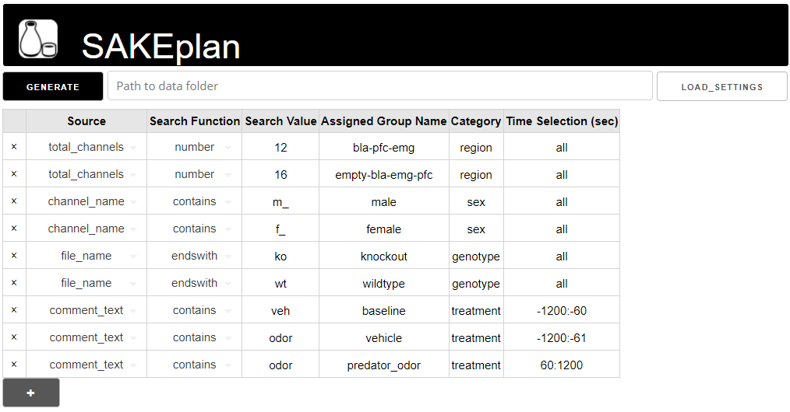

# sake-plan

Quickly organize your labchart data in [tidy format](https://r4ds.had.co.nz/tidy-data.html). 

-> Check out the [sake-plot toolbox](https://github.com/SAKEverse/sake-plot) :chart_with_upwards_trend: for spectral analysis of the tidy data.

---

## How to install and run

1) Download and install [miniconda](https://docs.conda.io/en/latest/miniconda.html) Python distribution, if you don't already have conda installed on your computer.
2) Clone or download [sake-plan](https://github.com/SAKEverse/sake-plan) repository.
3) Run 'SAKE Plan' file in the sake-plan repository. First run will install the app which will take several minutes.
